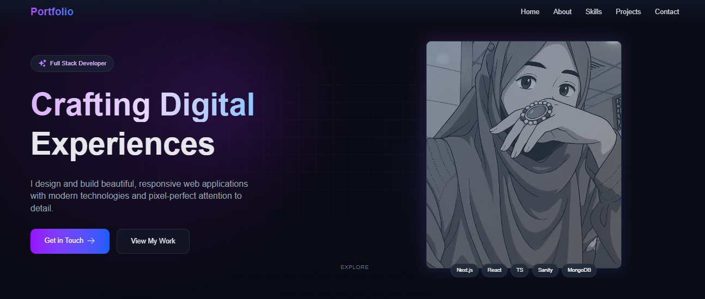

# ✨ Portfolio Project

  

## 🌟 Features

- **Modern UI** - Elegant dark theme with subtle animations
- **Responsive Design** - Flawless experience on all devices
- **Performance Optimized** - 90+ Lighthouse scores
- **Interactive Elements** - Smooth hover and focus states
- **Dynamic Content** - Easily customizable via CMS

## 🛠 Tech Stack

<table>
  <tr>
    <td align="center" width="96">
      
       Next.js
    </td>
    <td align="center" width="96">
      
       React
    </td>
    <td align="center" width="96">
      
       TypeScript
    </td>
    <td align="center" width="96">
      
       Tailwind
    </td>
  </tr>
  <tr>
    <td align="center" width="96">
      
       Vercel
    </td>
    <td align="center" width="96">
      
       Figma
    </td>
    <td align="center" width="96">
      
       Git
    </td>
    <td align="center" width="96">
      
       GitHub
    </td>
  </tr>
</table>